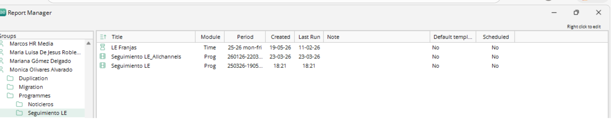
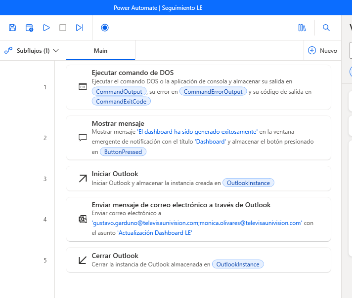
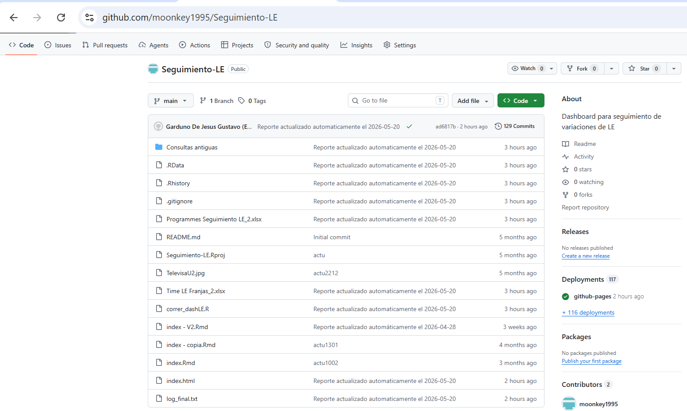

# Introducción

Este documento describe el proceso para la **actualización, ejecución y validación del Dashboard de Seguimiento LE**, incluyendo la automatización mediante Power Automate y la integración con GitHub.

---

# 1. Actualización de Consultas en HR-Media

La consulta **"Programes Seguimiento LE_2"** se actualiza diariamente en la plataforma **HR-Media - Insight TV**.  
Se encuentra como **"Seguimiento LE"** dentro de la carpeta de reportes de **Mónica Olivares**.

## Procedimiento

- Editar aumentando un día a la **fecha de inicio** y **fecha final**.
- Ejecutar la consulta.
- Exportar como archivo Excel con el nombre:
  
  **Programes Seguimiento LE_2**

La consulta **"LE Franjas"**:

- Se encuentra en la misma carpeta.
- Solo se ejecuta.
- Exportar como:

  **Time LE Franjas_2**

> ⚠️ **Importante**
>
> - Ambas consultas deben copiarse en la carpeta **Seguimiento-LE**  
> - Esta carpeta corresponde a la raíz del *Project File* de RStudio  
> - Eliminar versiones anteriores antes de copiar nuevas

---

---

# 2. Creación del Flujo en Power Automate

Se configura un flujo en **Power Automate** para automatizar la actualización del dashboard en **GitHub**.

## Configuración previa

- Usar la cuenta personal del propietario
- Instalar **Git Bash**
- Configurar credenciales en **RStudio**

## Configuración del flujo

Una vez completado lo anterior:

- Crear el flujo en Power Automate conforme al diseño establecido

## Funcionamiento

El flujo:

- Ejecuta el script **correr_dashLE**
- Genera el dashboard
- Sube archivos a GitHub
- Muestra mensaje en pantalla
- Envía correo de confirmación

---

---

# 3. Scripts

El script principal es:

**correr_dashLE.R**

## Configuración

- Ajustar los **paths** según la ubicación del *Project File*
- Guardar cambios

## Funcionalidad

Este script realiza:

1. Configuración de paths para Power Automate  
2. Generación del dashboard en HTML  
3. Actualización de archivos en GitHub  

El archivo:

**index.Rmd**

- Genera el dashboard HTML

> ⚠️ **Importante**
>
> Este archivo **no debe modificarse**

---

# 4. Ejecución y Validación

## Ejecución

- Ejecutar el flujo en Power Automate

## Validación automática

- ✅ Más de **40 segundos** + mensaje:
  
  → *"El dashboard ha sido generado exitosamente"*  
  → Proceso correcto

- ❌ Menos de 40 segundos  
  → Proceso posiblemente fallido

## Validación manual

1. Ir a:
   
   https://github.com/moonkey1995/Seguimiento-LE

2. Validar actualización de:
   - `index.html`
   - Archivos recientes

3. Abrir `index.html` y confirmar datos actualizados

> ⚠️ Si no se actualiza:
>
> - Revisar configuraciones
> - Verificar logs del flujo
> - Validar script

---

---

# 5. Uso General

Una vez configurado todo el proceso:

## Procedimiento operativo

1. Actualizar ambas consultas
2. Exportarlas con nombre correcto
3. Colocarlas en:
   
   **Seguimiento-LE**

4. Ejecutar flujo en Power Automate
5. Esperar finalización
6. Aceptar mensaje en pantalla
7. Revisar correo de confirmación
8. Validar en GitHub
9. Abrir `index.html` y verificar actualización

---

# Conclusión

Este flujo permite automatizar la generación y publicación del dashboard, asegurando consistencia, actualización oportuna y reducción de errores manuales.